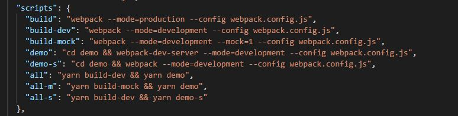

## Librería ui-beancentros-wc
El módulo se puede importar como umd, etiqueta link de la página html con lo que se definiría un global 'uiBeancentrosWc', tambien se puede importar como módulo npm, esta última es la aconsejada.

#### Indice
- objetos exportados
- customElements definidos
- Build y ejecución de la demo

***

#### Objetos exportados
```export {Tree, Modal, popup, popupi BeanCentros};```

Tree, Modal y BeanCentros son las clases que se definen como custom elements (ver descripción más adelante), la exportación de las mismas no sería necesaria.

La función popup: recibe un markup (árbol DOM) y lo muestra como emergente, apoyandose en _<bk-wc-ui-modal\></bk-wc-ui-modal\>_ (se describe más adelante), devuelve la función de cierre y emite un evento bk-close sobre el elemento markup al cerrar el emergente, los estilos de markup los obtiene de la aplicación anfitrión.

La función popupi: recibe un markup (árbol DOM) y el estilo en forma de String lo muestra como emergente, apoyandose en _<bk-wc-ui-modal\></bk-wc-ui-modal\>_ (se describe más adelante), devuelve la función de cierre y emite un evento bk-close sobre el elemento markup al cerrar el emergente, los estilos de markup los obtiene de los estilos pasados y todo se engloba dentro del shadowDom

```
function popup(markup){
    const h = ()=> {
        markup.dispatchEvent(new CustomEvent('bk-clean',{bubbles: true}))
        el.removeEventListener('bk-close', h) 
    }
    const el = document.createElement('bk-wc-ui-modal')
    el.addEventListener('bk-close', h)
    el.appendChild(markup)
    document.body.appendChild(el)
    return el.close
}

function popupi(markup, styles){
    const h = ()=> {
        markup.dispatchEvent(new CustomEvent('bk-clean',{bubbles: true}))
        el.removeEventListener('bk-close', h) 
    }
    const el = document.createElement('bk-wc-ui-modal')
    el.addEventListener('bk-close', h) 
    el.style.top = '-1500px'
    if (markup){
        el.inject(markup, styles)
    }
    document.body.appendChild(el)
    return el.close
}
```

***

#### customElements definidos

- _<bk-wc-ui-tree\></bk-wc-ui-tree\>_

Expone la propiedade de lectura/escritura __data__, la propiedad de lectura __selected__ y la de escritura __selecteId__, emite eventos __bk-change__. La carga de los nodos del arbol en DOM es perezosa por lo que admite árboles con muy alto número de nodos.

Ejemplo de uso:
```
const data = [
    {id: '1', text: "nodo raiz 1", padre: null, payload: {}},
    {id: '2', text: "nodo raiz 2", padre: null, payload: {}},
    {id: '3', text: "nodo 1", padre: '1', payload: {}},
    {id: '4', text: "nodo 2", padre: '1', payload: {}},
    {id: '5', text: "nodo 1fgd", padre: '2', payload: {}},
    {id: '6', text: "nodo 2fgd", padre: '2', payload: {}},
    {id: '7', text: "nodo ggh1", padre: '5', payload: {}},
    {id: '8', text: "nodo gfh2", padre: '5', payload: {}},

]
const it = document.querySelector('bk-wc-ui-tree')
it.data = data
it.addEventListener('bk-change', e => console.log(e))
it.selectedId = '8'
```
Aspecto:


***

- _<bk-wc-ui-modal\></bk-wc-ui-modal\>_

Representa un modal cuyo contenido es recibido mediante __<slot\></slot\>__, dispone además del método __close__ y emite el evento __bk-close__ cuando se cierra. Existe la función exportada 'popup' que se apoya en este componente y es quizá más sencilla de usar.

Ejemplo:

__html__
```
<bk-wc-ui-modal>
    wdwojdiqwdpqwiqwi<br/>
    twertwertweoptweirtweot`
    <button id='b'>hola</button>
</bk-wc-ui-modal>
```
__js__
```
const it2 = document.querySelector('bk-wc-ui-modal')
const b = document.querySelector('#b')
b.addEventListener('click', e => console.log(e))
it2.addEventListener('bk-close', e => console.log(e)
```
O con templates, __js__
```
const templateNode = document.createElement('template')
templateNode.innerHTML = `<div>
                            wdwojdiqwdpqwiqwi<br/>
                            twertwertweoptweirtweot
                            <button id='b'>hola</button>
                        </div>`
const tmp = templateNode.content.cloneNode(true)
const b = tmp.querySelector('#b')
b.addEventListener('click', e => console.log(e))
const close = popup(tmp)
setTimeout(()=>close(), 5000)
```
Aspecto:


***
- _<bk-wc-ui-bean-centros\></bk-wc-ui-bean-centros\>_

Responde al cambio de tres atributos, __centro__, __cuspide__ y __disabled__, además proporciona las mismas tres propiedades como de lectura/escritura, Emite un customEvent __bk-change__ con la información del nuevo centro seleccionado, el bean valida y solo permite ajustar un centro existente en la jerarquía, partiendo del cúspide, si además se deja la caja de selección de texto vacía y se pulsa intro o el botón de acción se levanta un emergente que permite seleccionar el centro. Hace dos llamadas a tabit por lo que el host que sirva la aplicación deberá establecer reglas proxy apropiadas (más adelante en ___build y ejecución de la demo___)

Ejemplo:

__html__
```
<bk-wc-ui-bean-centros centro="08187" cuspide="92658"></bk-wc-ui-bean-centros>
<div>Centro seleccionado: <span id='centro'></span></div>
``` 
__js__
```
const centro = document.querySelector('#centro')
const bean = document.querySelector('bk-wc-ui-bean-centros')
bean.addEventListener('bk-change',(e)=>centro.innerText=e.detail.id)
centro.innerText = bean.centro
```

Aspecto:


Desde la pestaña de búsqueda se habilita el filtro si (centro.length >1 || descripción.length > 3) y siempre que haya algún checkbox seleccionado, el resultado de la búsqueda es un OR lógico.

Cuando se selecciona un centro en búsqueda y se pasa a jerrarquía el centro es árbol es desplegado y el centro seleccionado en esta pestaña de destino.

El botón aceptar solo se habilita cuando haya un centro seleccionado.
***
### Build y ejecución de la demo
Estas son las entradas disponibles en package.json:



___build___ construye la versión de la librería para producción.

___build-dev___ construye la versión de la librería sin minificar

___buid-mock___ librería mockeada respecto a los servicios tabit (!Usando cuspide="92658"!)

___demo___ ejecuta el dev server previamente habiendo compilado en modo dev

__demo-s___ construye la demo como carpeta para servir con otro server (como apache) y a partir de la librería dev

___all___ Es el más habitual, contruye dev y ejecuta la demo con devserver.

___all-m___ Construye dev mockeado y la demo con ejecuta devserver

___all-s___ Construye dev y genera carpeta para servir en http server aparte.

El devServer tiene las siguientes reglas proxy:


