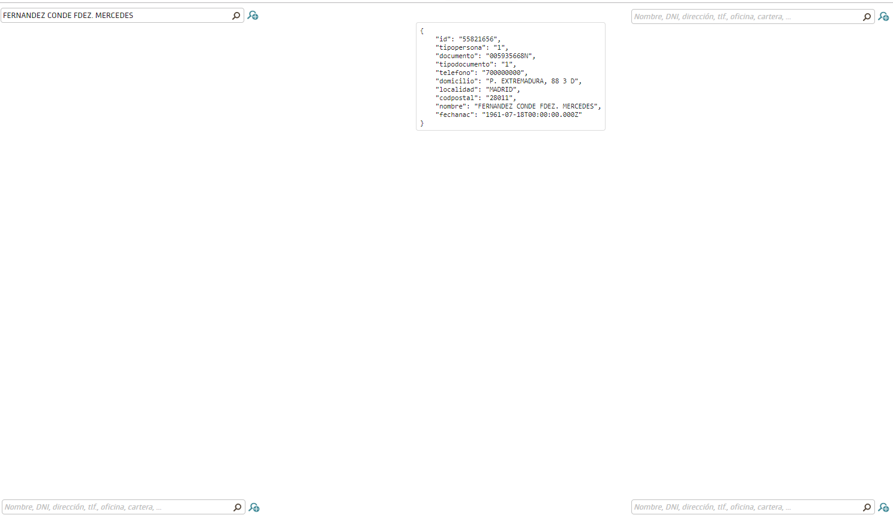
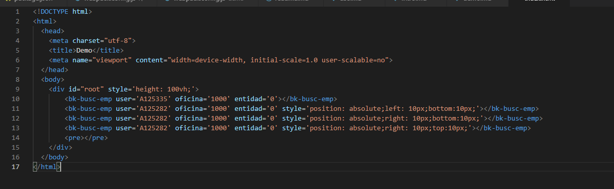
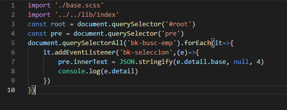
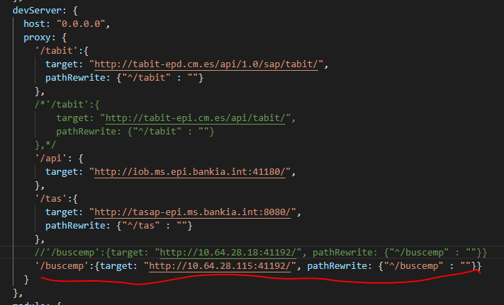

# Ejecición de la demo

Para ejecutar la demo hay que hacer

1. `npm install` para cargar las dependencias npm
2. `yarn demo` si se tiene yarn o `npm run demo`

Para acceder, apuntar chrome a http://localhost:8080, en la página aparecen cuatro instancias del componente, una en cada esquina de la pantalla, se puede comprobar el funcionamiento y testear que la capa predictiva aparece por la parte del componente adecuada en cada caso, cuando se emite un evento __bk-seleccion__ se pintará en el centro de la pantalla el resultado de __detail.base__

El código que ejecuta es realmente simple:

__HTML__

__JAVASCRIPT__

Hay que notar que para el funcionamiento correcto debe estar correcta la regla de proxy para `/buscemp` en __webpack.config.js de la demo__, __ui-predictivo-wc\demo\webpack.config.js__, ¡ _No confundir con el webpack.config.js de la librería!_, hay dos.

A día de hoy funciona en EPD con la ip que se detalla, pero esto puede cambiar con el tiempo.

Solo se necesita la regla de buscemp, las otras no son necesarias para este proyecto

