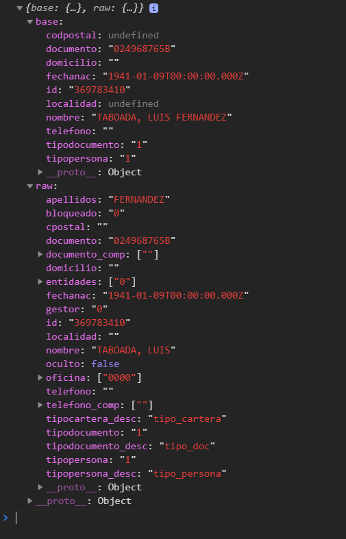
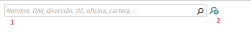
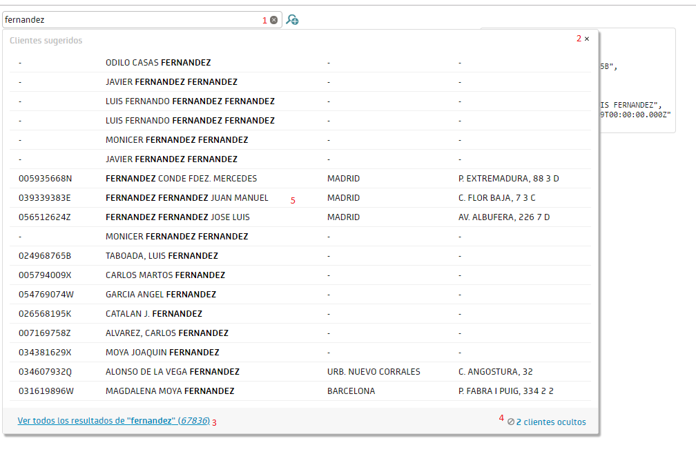
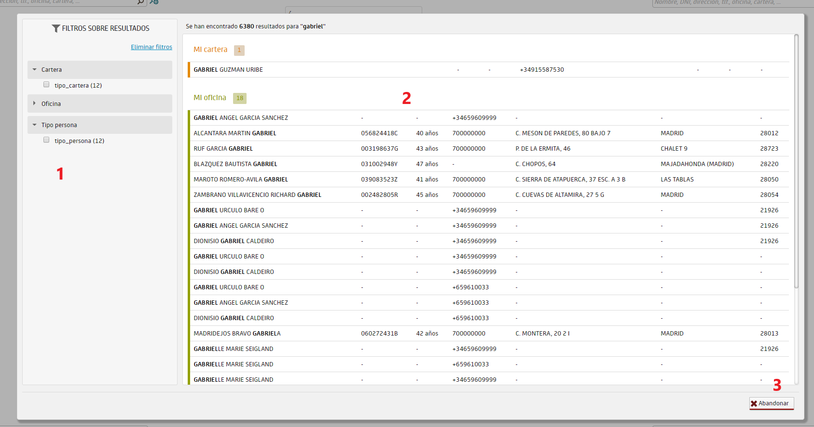

# Introducción

El componente exporta un tag  nuevo html __bk-busc-emp__

`<bk-busc-emp user='A125335' oficina='1000' entidad='0'></bk-busc-emp>`

El mismo recibe como atributos user, oficina y entidad, los tres obligatorios, la salida del componente la hace emitiendo un evento cuando se selecciona un cliente, el evento contiene un campo con la información del cliente seleccionado, __detail__, nos podemos suscribir con:

`busc.addEventListener('bk-seleccion',(e)=>{console.log(e.detail)}`

El objeto __detail__ contiene dos propiedades, __base__ y __raw__, nótese que la selección de cliente se puede hacer en la práctica a través del API SOLR, pero también a través de la búsqueda avanzada de cliente de NEO, __base__ trata de resumir los campos comunes de ambas búsquedas y __raw__ devuelve la respuesta original que puede variar dependiendo de como se buscó el cliente.

## Interface
1. __Caja de búsqueda__: empezará a cargar los registros coincidentes a partir de escribir el tercer caracter. Conforme vayamos escribiendo en la caja de búsqueda el resultado de la capa predictiva cambiará. Pulsando __'enter'__ con el foco en la caja de búsqueda se arrancará la __vista de detalle__. Pulsando __'ESC'__ se desactivará la capa de búsqueda.

2. __Enlace a buscador avanzado de Neo__. 

## Búsqueda predictiva

1. Manejador para abortar la capa predictiva y la búsqueda

2. Lo mismo que lo anterior desde la capa predictiva

3. Enlace para abrir la __vista de detalle__

4. Indicador de los clientes ocultos (bloqueados y/o confidenciales)

5. Registros clickables, pulsando en uno se cerrará la capa y se emitirá el evento __bk-seleccion__ indicado arriba.

## Vista de detalle

1. __Filtros sobre resultados__: Se puede filtrar por cartera, oficina y tipo Persona, el filtrado es un AND lógico de las secciones con un OR de los items seleccionados en cada sessión, cuando se está en __'modo filtro'__ (algún checkbox seleccionado) se deshabilita el scroll infinito. El formulario de búsqueda es dinámico y se recargarán sus opciones cuando se incremente el número de resultados.

2. __Area de resultados__: Mostrará los resultados agrupados por 'Mi cartera', 'Mi oficina' y 'Otras oficinas', Los registros son clickables, pulsando en uno se cerrará la capa y se emitirá el evento __bk-seleccion__ indicado arriba.

3. __Scroll infinito__: Al bajar el scroll se cargarán nuevos resultados, hasta que se complete el total, esto ocurrirá siempre que no se esté en __'modo filtro'__.

